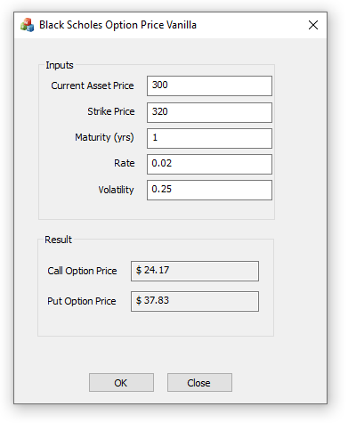

# Black Scholes Option Price
**Black-Scholes Example of European Option Price in C++**

This example show the use of the **erfc** error function implementing a Normal distribution CDF to calculate a Call and a Put (European option) using Black-Scholes formula in C++.

The GUID is written in MFC, but the relevant code that deals with the computation is decoupled from the UI and it can be examined by itself alone.

  

